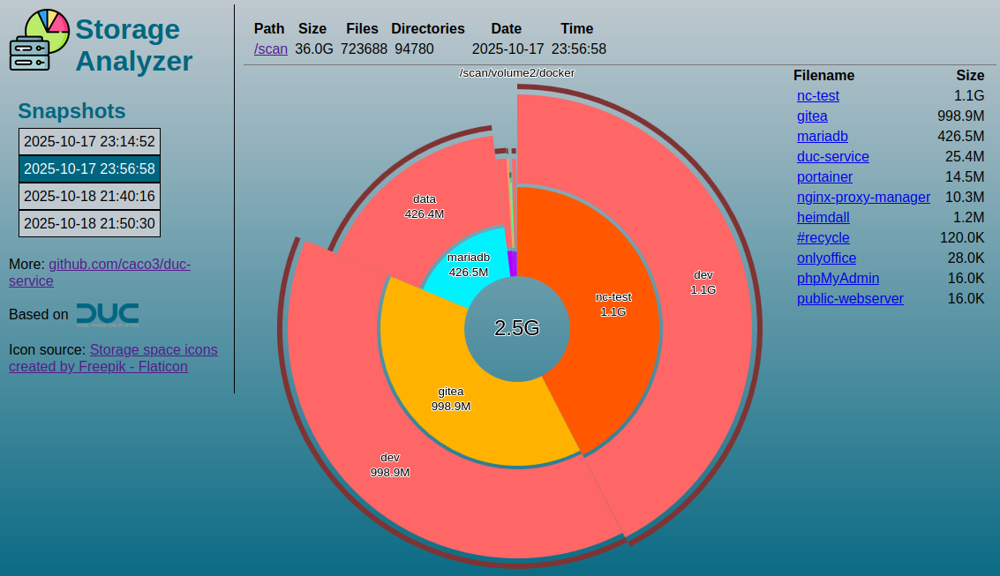

# Duc-Service
[](https://hub.docker.com/r/caco3x/duc-service/)
[](https://hub.docker.com/r/caco3x/duc-service/)
[](https://hub.docker.com/r/caco3x/duc-service/)

Run [Duc](https://duc.zevv.nl/) in Docker and re-index the file system using a schedule.
The results can be viewed in a webbrowser:



The built docker images can be found on [Docker Hub](https://hub.docker.com/r/caco3x/duc-service/).

# Features
- Included scheduling for automatic scanning
- Single-command deployment
- Very small image footprint
- Web UI to view and manage the snapshots

## Usage Examples
### With Docker Compose
Use [docker-compose.yml](docker-compose.yml).

Run it with 
```
docker compose up --build --detach
```

### Without Docker Compose
```
docker run -e "SCHEDULE=0 0 * * *" -e "RUN_SCAN_ON_STARTUP=false" \
    -e "EXCLUDE=proc sys dev run tmp temp usr proc" -p 80:80 \
    --mount type=bind,src=/,dst=/scan/root,readonly \
    --mount type=volume,src=duc_database,dst=/database \
    caco3x/duc-service
```

## Parameters
 - ### SCHEDULE
   A cron-expression that determines when an automatic scan is started.

 - ### RUN_SCAN_ON_STARTUP
   Set to true if a snapshot should be created on each docker container start

 - ### EXCLUDE
   Folder/file patterns to be excluded (comma separated list without double quotes).

   Example: `proc sys dev run tmp temp usr proc`

## Web Endpoints
- `/duc.cgi` provides a web gui to explore the disk usage
- `/manual_scan.cgi` queues a manual scan
- `/log.cgi` displays the log output from the last scan

## Developing
Build, tag and publish:
```
docker build . --file Dockerfile --tag caco3x/duc-service:latest

sudo docker login -u caco3x
sudo docker push caco3x/duc-service:latest
```

## References
- Duc homepage: https://duc.zevv.nl/

## Similar Projects
- https://github.com/MaximilianKoestler/duc-service
- https://hub.docker.com/r/tigerdockermediocore/duc-docker
- https://hub.docker.com/r/digitalman2112/duc
